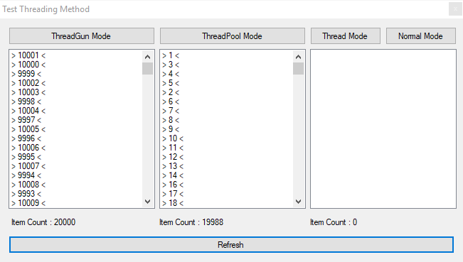
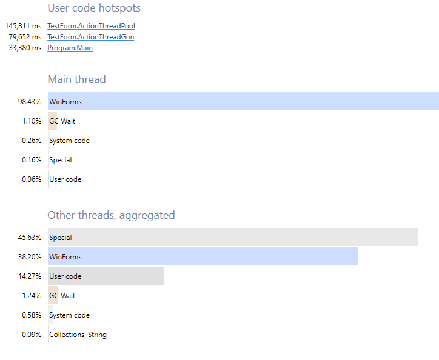

# ThreadGun
ThreadGun is a form of multithreading created for developers keen on building fast and stable application.

# Features
- Easy [Installation](https://github.com/RexProg/ThreadGun#Installation) using [NuGet](http://nuget.org/packages/ThreadGun)
- Optimum perfomance
- will be notify when exception occurred
- will be notify when process completed

# ThreadPool vs ThreadGun
- ThreadGun is more accurate than ThreadPool
- ThreadGun is faster than ThreadPool



# Examples
See the [Example project](https://github.com/RexProg/ThreadGun/tree/master/TestThreadingMethod).

# Getting Started
First, add ThreadGun to your project using [NuGet](https://github.com/RexProg/ThreadGun#Installation).
look at Simple [Example](https://github.com/RexProg/ThreadGun/blob/master/TestThreadingMethod/TestForm.cs)
```csharp
private void btnThreadGun_Click(object sender, EventArgs e)
{
    lstThreadGunResult.Items.Clear();
    var tg = new ThreadGun<int>(ActionThreadGun, Enumerable.Range(1, 50000), 20);
    tg.Completed += tg_Completed;
    tg.ExceptionOccurred += tg_ExceptionOccurred;
    tg.Start();
}
private void tg_ExceptionOccurred(IEnumerable<int> inputs, Exception exception)
{
    MessageBox.Show(exception.Message);
}
private void tg_Completed(object inputs)
{
    lblInfoThreadGun.Text = $@"Item Count : {lstThreadGunResult.Items.Count}";
}
public void ActionThreadGun(int i)
{
    lstThreadGunResult.Items.Add($@"> {i} <");
    Application.DoEvents();
    if (i == 250)
      throw new Exception("ExceptionOccurred Test!");
}
```
If you have a method with more than one parameter, you can put the parameters in another class and change method's input type to it.

For Example :

```csharp
public void ActionThreadGun(int i,int j)
{
    lstThreadGunResult.Items.Add($@"> {i} , {j} <");
    Application.DoEvents();
    if (i == 250)
      throw new Exception("ExceptionOccurred Test!");
}
```
Change it to :
```csharp
public void ActionThreadGun(Point p)
{
    lstThreadGunResult.Items.Add($@"> {p.i} , {p.j} <");
    Application.DoEvents();
    if (p.i == 250)
      throw new Exception("ExceptionOccurred Test!");
}
public class Point
{
  public int i { get; set; }
  public int j { get; set; }
}
```
```csharp
new ThreadGun<Point>(ActionThreadGun, new List<Point>() { new Point() { i = 20, j = 40 } }, 20);
```

# Usage
```csharp
new ThreadGun<T>(Action, IEnumerable<T>, ThreadCount)
```
- T is type of inputs
- Action is the method that you want to invoke and type of that method's parameter is T
- IEnumerable<T> is your input which type of that is T
- ThreadCount is count of thread executed action at same time

# Installation

Install as [NuGet package](https://www.nuget.org/packages/ThreadGun):

Package manager:

```powershell
Install-Package ThreadGun
```
